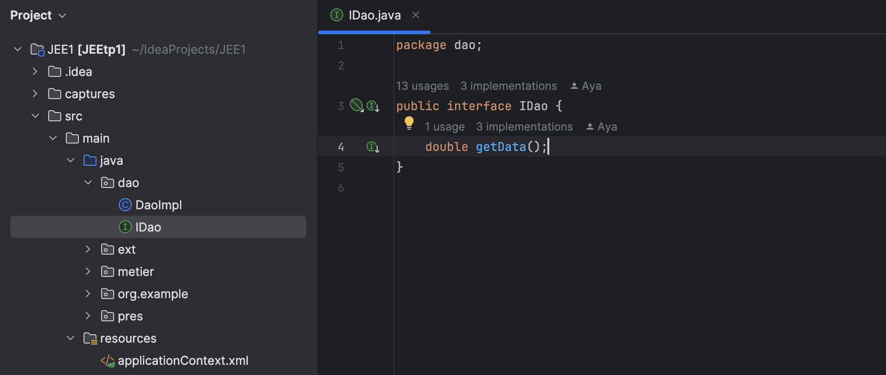
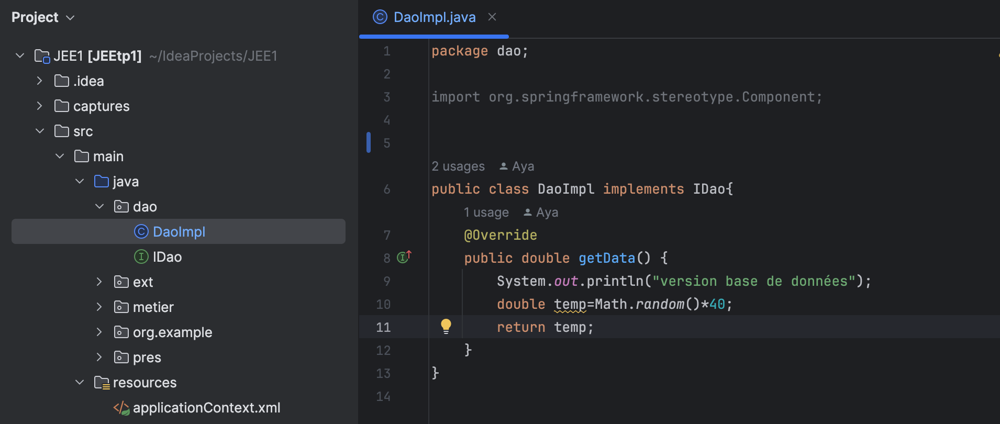
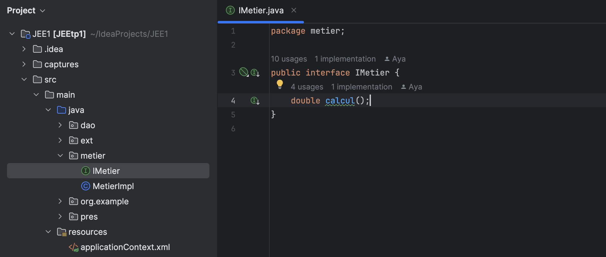
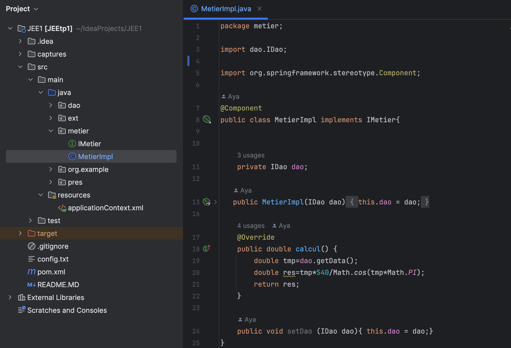
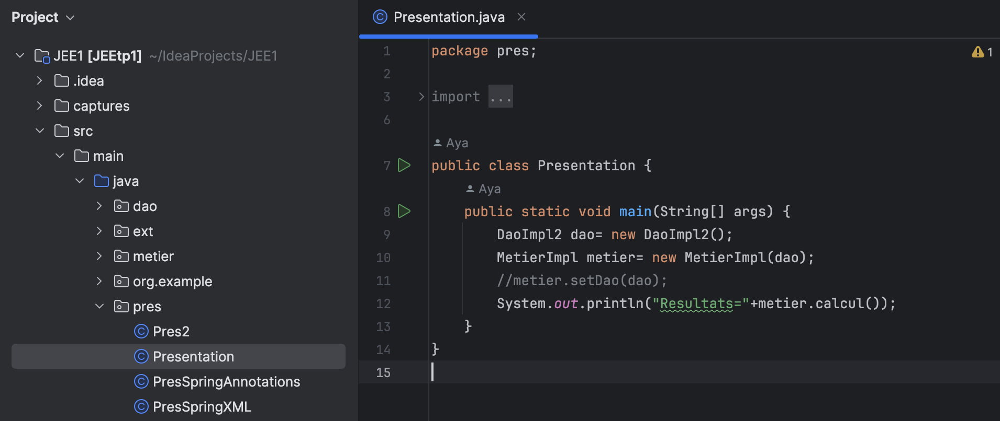
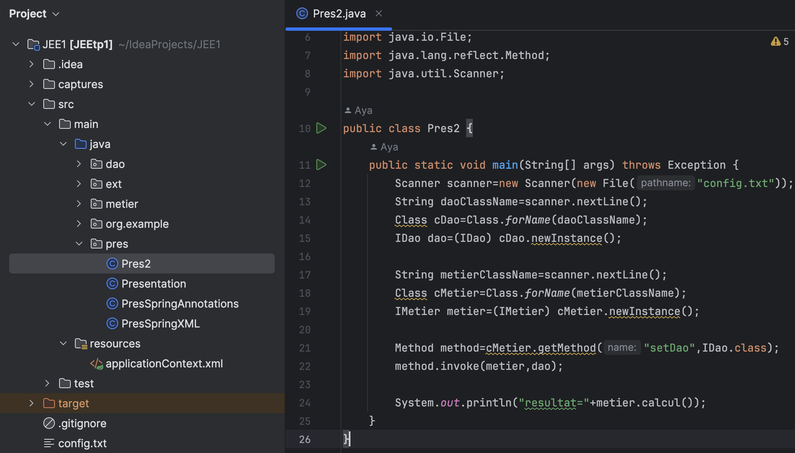
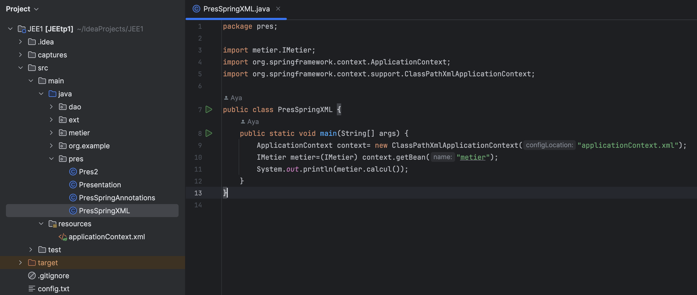
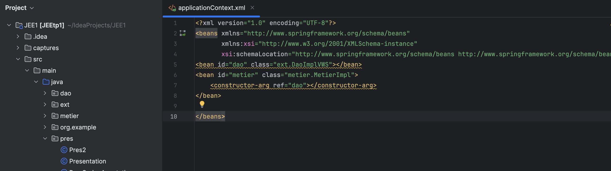
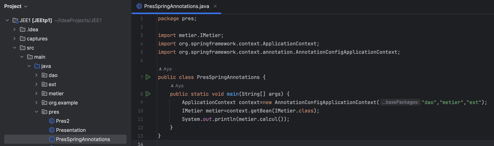

<h1> Compte rendu </h1>
<h3> Afirrah Aya G1 </h3>
<h4> 1. Création de l'interface IDao avec une méthode getDate :</h4>

<h4> 2. Implémentation de l'interface IDao :   </h4>

<h4> 3. Création de l'interface IMetier avec une méthode calcul :</h4>

<h4> 4. Implémentation de l'interface IMetier en utilisant le couplage faible : </h4>

<h4> 5. Injection des dépendances :</h4>

<h4> a. Par instanciation statique :</h4>

<h4> b. Par instanciation dynamique :</h4>

<h4> c. En utilisant le Framework Spring :</h4>
<h4> XML : </h4>

<h4> Annotation : </h4>

